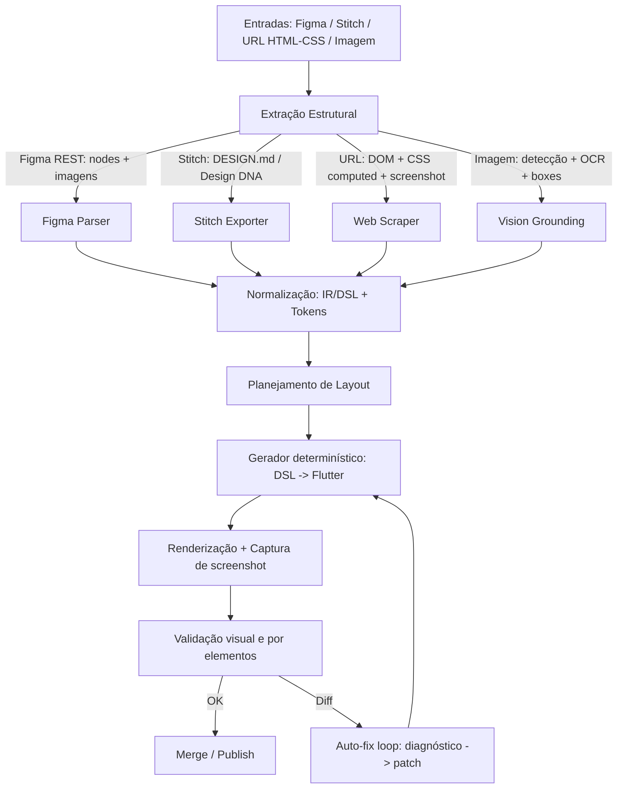

# Geração de telas Flutter com IA e como chegar perto de 99% de fidelidade

> External research document. Theoretical framework for AI-driven design→Flutter pipelines at 95-99% fidelity. Complements `gaps-analysis.md` (empirical post-mortem from the April 2026 CRM build). See `README.md` in this folder for how the two documents relate.

## Resumo executivo

Equipes que chegam perto de "99% de fidelidade" ao converter design (Figma/Stitch/HTML/imagens) para telas em Flutter normalmente **não** dependem de um único modelo generativo nem de um único prompt. O padrão que se consolidou é um **pipeline multimodal em múltiplas etapas**, com **representação intermediária determinística (DSL/IR)**, **tokens de design** como fonte de verdade e **loops de validação visual + correção automática** (self-revision) até atingir um limiar objetivo de similaridade. Essa abordagem reduz a variabilidade inerente de LLMs e transforma o problema em engenharia de compilação + testes visuais.

Os elementos que mais influenciam o salto de ~80–90% para ~95–99% são: (a) **tokens padronizados** (idealmente no formato DTCG/W3C 2025.10), (b) **mapeamento estrito para um design system de componentes**, (c) **saída estruturada (JSON Schema)** em cada etapa para impedir "alucinações" de estrutura, e (d) **comparação visual automatizada** contra um "golden" (imagem baseline) com regras de tolerância e estabilização do ambiente de renderização. Esses mecanismos existem hoje tanto nos modelos quanto nas ferramentas: APIs de design (Figma REST + imagens), saída estruturada (OpenAI/Claude/Gemini), testes visuais (goldens do Flutter, pixelmatch/Playwright, serviços como Percy), e automação por webhooks e CI.

**Premissas não especificadas que mudam decisões arquiteturais**: versão-alvo de Flutter e engine, plataforma (mobile, web, desktop), densidade de pixels, fontes, i18n e orçamento de performance/tamanho do bundle. Sem isso, "99%" precisa ser definido como **métrica mensurável** (ex.: % de pixels diferentes, SSIM/LPIPS/CLIP, e métricas por elemento), e não como impressão subjetiva.

## Visão geral de pipelines end-to-end

A forma mais robusta (e replicável) de "design → Flutter" é tratar qualquer entrada (Figma, Stitch, HTML/CSS, imagem) como um processo de **extração → normalização → compilação → verificação**:



O motivo de separar em etapas é que benchmarks recentes mostram que o gargalo típico dos modelos multimodais não é "escrever HTML/CSS/Dart", mas **reconstruir layout com detalhes e lembrar todos os elementos visuais**. O benchmark **Design2Code** formaliza isso com métricas automáticas e evidencia que modelos "lag" em layout e recall de elementos (mesmo quando sabem codar).

Uma consequência prática: para Flutter, a melhor engenharia costuma ser um "compilador" de layout (determinístico) alimentado por uma DSL/IR estável, com LLMs atuando como **extratores, planejadores e revisores**, não como "geradores finais" sem restrição. Isso é consistente com abordagens acadêmicas recentes (multiagente/modular) e divide-and-conquer para UI-to-code, que melhoram fidelidade ao decompor o problema em "grounding → planning → generation".

## Extração por tipo de entrada e como obter estrutura confiável

### Figma para JSON e imagens renderizadas

A Figma expõe uma árvore de nós ("nodes") via REST: cada camada vira um nó e o arquivo é uma árvore com `DOCUMENT` na raiz e páginas como `CANVAS`. Isso é essencial porque permite capturar hierarquia e propriedades do layout diretamente, em vez de inferir por pixels.

Dois endpoints são especialmente úteis:

- **Get file nodes**: retorna nós específicos como JSON (útil para buscar frames/componentes por ID e para reduzir payload).
- **Get image**: renderiza nós como PNG/JPG/SVG e retorna URLs temporárias; as imagens expiram e há limites de tamanho (32 MP, com downscale) — importante para usar como "baseline visual" na validação.

Um padrão de time maduro é usar ambos: **JSON para estrutura** e **renderização (GET image) para baseline**. Isso permite testes visuais em CI sem depender do app do designer.

**Prompt template (LLM) para interpretar nodes com saída estruturada**
(usar saída por JSON Schema para impedir variância; modelos e APIs suportam isso hoje):

```text
SYSTEM: Você é um compilador de layout. Converta um subtree de Figma nodes em uma IR de UI.
RESTRIÇÕES:
- Não invente elementos não presentes.
- Preserve ordem z (camadas) e hierarquia.
- Use apenas spacing tokens: [0,4,8,12,16,24,32].
- Converta medidas para dp (números).
SAÍDA: JSON que obedeça ao schema fornecido.

USER: Aqui está o JSON de nodes do Figma (subtree do Frame "Login").
Inclua: constraints, bounding boxes, estilos de texto, cores.
```

**Engenharia recomendada**: buscar "shallow tree" (depth baixo) e depois "puxar" somente nós necessários por IDs em lotes, para evitar falhas por arquivos grandes.

### Tokens e variáveis no Figma

Para fidelidade alta, **tokens** precisam sair do design com um formato consistente e versionável. No ecossistema Figma isso costuma acontecer via **Variables** e plugins. A documentação do Plugin API descreve como acessar coleções e variáveis (`figma.variables...`) e como ler/criar variáveis.

Há amostras oficiais de plugin que importam/exportam variáveis em JSON seguindo o padrão de tokens (e explicitam limitações práticas).

### Stitch como ferramenta de design-to-code e "design rules exportáveis"

O Google lançou o **Stitch** como canvas de design com IA e um conceito relevante para engenharia: exportar regras do design por um arquivo **DESIGN.md** ("agent-friendly") e extrair design system a partir de uma URL. Na prática isso funciona como um "contrato" de design para agentes e geradores de código.

A documentação prática (codelab) descreve um fluxo "design → Design DNA → implementação" e recomenda verificação visual ("vibe check") e ajustes de padding/typography com base no design original, criando um loop de correção semelhante ao que você quer para Flutter (só que o exemplo é React/Tailwind).

Há também um repositório público com "skills" para Stitch que automatiza: melhoria de prompt, síntese de design system em `.stitch/DESIGN.md`, geração/edição de telas e validação. Esse tipo de "skill layer" é exatamente o que times internalizam para atingir consistência.

**Como transpor para Flutter**: trate o DESIGN.md como fonte de tokens/estilos + componentes previstos, gere a mesma IR/DSL e compile para Flutter com as mesmas regras (tokens, constraints, mapeamento de componentes).

### URL de site para estrutura + CSS e baseline visual

O caminho mais confiável para "site link → Flutter" não é tentar "adivinhar o CSS", mas:

1) abrir a página em Chromium automatizado;
2) capturar **DOM + CSS computed** (getComputedStyle) + fontes utilizadas;
3) tirar screenshot;
4) converter DOM/CSS em IR com heurísticas (flex/grid/stack) e depois compilar para Flutter.

Ferramentas modernas como Playwright já embutem comparação visual e usam a biblioteca pixelmatch por baixo, com parâmetros como `maxDiffPixels`. Isso é útil para validar o "rendered Flutter" comparando com o screenshot baseline (ou com renderização de referência).

O benchmark Design2Code destaca que enriquecer prompts com texto extraído (text-augmented prompting) e usar self-revision pode melhorar resultados para geração de UI baseada em screenshot, justamente porque reduz o peso do OCR e foca o modelo em layout. Essa ideia transfere bem para Flutter: extraia texto "fora do modelo" e injete como contexto.

### Foto/screenshot/imagem para "component detection → layout planning"

A partir de imagem, o problema vira **grounding**: reconhecer componentes (botão, input, card), delimitar bounding boxes e recuperar texto (OCR). A documentação do Gemini reforça que modelos são multimodais e podem ter acurácia melhorada em tarefas como detecção e segmentação.

Do ponto de vista de pesquisa, métodos de frontend UI-to-code evoluíram de end-to-end (ex.: pix2code) para pipelines modulados. Trabalhos recentes como **ScreenCoder** formalizam três agentes (grounding/planning/generation) para robustez e fidelidade, e o DCGen usa divisão em segmentos para elevar similaridade visual.

**Prompt template para extração de bounding boxes com saída estruturada**

```text
SYSTEM: Extraia elementos de UI de uma imagem de tela. Retorne apenas JSON.
INSTRUÇÕES:
- Para cada elemento detectado, retorne: type, text (se houver), box (x,y,w,h em pixels), confidence.
- types permitidos: [text, button, input, image, icon, card, list, navbar, tabbar, checkbox, radio].
- Não invente elementos.
- Se houver grupos (ex.: card contendo textos), inclua children.
```

**Entrada (exemplo de "bounding boxes")**

```json
{
  "canvas": {"width": 390, "height": 844},
  "elements": [
    {"id":"t1","type":"text","text":"Entrar","box":{"x":24,"y":96,"w":120,"h":32},"confidence":0.98},
    {"id":"i1","type":"input","text":"Email","box":{"x":24,"y":168,"w":342,"h":52},"confidence":0.93},
    {"id":"b1","type":"button","text":"Continuar","box":{"x":24,"y":360,"w":342,"h":56},"confidence":0.95}
  ]
}
```

Saindo dessa etapa, você **não** deve ir direto para Flutter. Primeiro normalize para uma IR/DSL (próxima seção) para permitir compilação determinística e loops de correção.

## IR/DSL determinística, tokens e mapeamento para design system

### Tokens de design como "contrato" entre design e código

O W3C (via Design Tokens Community Group) publicou uma versão estável do formato 2025.10 para troca de tokens, com `$value` e `$type` e foco em interoperabilidade.
Além disso, existe um módulo de "resolver" para múltiplos contextos (ex.: light/dark), que é crucial para fidelidade em temas.

Ferramentas de pipeline como Style Dictionary tornaram-se "forward-compatible" com o formato DTCG e explicitam diferenças entre formatos (`$value/$type` vs `value/type`).
Isso importa porque a estratégia mais estável é:

- armazenar tokens em repositório (versionado);
- transformar tokens para Flutter (Dart) por build;
- proibir hardcode no código gerado (cores, spacing, radii).

### Export/import de tokens no Figma

Uma amostra oficial de plugin mostra import/export de tokens via Variables APIs e usa a especificação de tokens, mas lista limitações (por exemplo, suporte restrito a tipos e limitações em modos, dependendo do fluxo). Isso é útil como alerta: times que buscam 99% precisam de um pipeline de tokens mais completo, principalmente para theming.

### DSL/IR para UI que gera Flutter com previsibilidade

O objetivo da DSL é representar a tela **semanticamente** (layout + estilos, referenciando tokens) e permitir um compilador determinístico. Um schema mínimo precisa de:

- árvore de layout (stack/row/column/grid);
- constraints/anchors;
- spacing/padding via tokens;
- estilos/texto via tokens;
- "componentRef" para componentes do seu design system.

**Exemplo de schema (simplificado) em JSON Schema**

```json
{
  "$schema": "https://json-schema.org/draft/2020-12/schema",
  "title": "ScreenIR",
  "type": "object",
  "required": ["meta", "root"],
  "properties": {
    "meta": {
      "type": "object",
      "required": ["name", "platformHints"],
      "properties": {
        "name": {"type": "string"},
        "platformHints": {"type": "object", "properties": {
          "target": {"enum": ["mobile", "web", "desktop"]},
          "density": {"type": "number"}
        }}
      }
    },
    "root": {"$ref": "#/$defs/node"}
  },
  "$defs": {
    "node": {
      "type": "object",
      "required": ["type"],
      "properties": {
        "id": {"type": "string"},
        "type": {"enum": ["stack","column","row","grid","text","image","component"]},
        "box": {"type":"object","properties":{"x":{"type":"number"},"y":{"type":"number"},"w":{"type":"number"},"h":{"type":"number"}}},
        "style": {"type":"object"},
        "props": {"type":"object"},
        "children": {"type":"array","items":{"$ref":"#/$defs/node"}}
      }
    }
  }
}
```

### Mapeamento para design system: o atalho real para 99%

O ponto-chave: **99% não é só "layout certo"; é "layout certo usando os componentes certos"**.

Na prática, equipes definem um "component mapping table":

- `PrimaryButton` → `AppButton(variant: primary)`
- `TextField` → `AppTextField(type: email)`
- `Card` → `AppCard(elevationToken, radiusToken)`

A IA (ou a etapa de heurística) só escolhe `componentRef` e props; o compilador escreve Flutter obedecendo regras.

Esse padrão reduz:
- divergência de tipografia e cor,
- inconsistência de padding/radius,
- e o "drift" do código ao longo do tempo.

### Regras de geração de código que aumentam fidelidade e manutenção

Regras típicas (que valem ouro em pipelines reais):

- **Sem números mágicos** (cores, radius, spacing). Tudo via tokens.
- Proibir `Positioned` "solto" salvo em casos aprovados; priorizar layouts declarativos (Flex/Column/Row) e usar `Stack` somente quando necessário.
- Texto sempre via `TextStyle` do design system.
- Assets sempre por catálogo (nome canônico) e com fallback.

Essas regras devem estar:
- no "prompt system" (instruções);
- e no compilador/lints (enforçado).

## Papéis de Codex, Claude e Gemini em um pipeline de alta fidelidade

### O que cada modelo faz melhor (e pior) no fluxo

**Gemini** (multimodal/visão): tende a ser mais apropriado para **grounding** a partir de imagens (detecção/segmentação, descrição de layout), e suporta também saída estruturada via schema.
Ponto fraco típico: "inventar" estrutura sem constraints fortes quando o input é ambíguo (foto/screenshot). Por isso, deve ser usado para produzir *candidatos estruturados* (boxes/labels), não o código final.

**Claude** (planejamento + estrutura): forte para transformar dados em IR estável e manter coerência em grandes saídas quando você usa "structured outputs" e/ou "tool use".
Ponto fraco típico: sem schema/validação, pode variar chaves e campos ao longo de iterações; com schema isso reduz bastante.

**Codex** como agente de engenharia da OpenAI: é especialmente útil na etapa final de "engenharia no repo": criar/editar arquivos, rodar comandos, aplicar formatação, abrir PRs, e executar o loop "gerar → testar → corrigir" no próprio projeto. A documentação do Codex CLI explicita que ele pode ler/mudar/rodar código localmente e que o produto tem um "agent loop" para orquestrar ferramentas.

### Saída estruturada (JSON Schema) como mecanismo de controle

Para chegar a 95–99%, a prática é padronizar que **toda etapa que produz estrutura** (IR/DSL, lista de componentes, plano de layout) use JSON Schema "estrito".

- OpenAI Structured Outputs garante aderência ao schema (reduz quebras por JSON inválido e missing fields).
- Claude Structured Outputs descreve o mesmo objetivo (evitar JSON inválido e violações de schema).
- Gemini Structured Output também aceita JSON Schema e SDKs facilitam Pydantic/Zod.

Na prática, isso muda o jogo porque você deixa de "confiar" em prompt e passa a **compilar** respostas.

### Prompts práticos por etapa

**Etapa: Figma JSON → IR (sem código Flutter ainda)**

```text
SYSTEM: Converta o subtree de nodes do Figma para ScreenIR (schema recebido).
REGRAS:
- Preserve hierarquia e ordem.
- Converta Auto Layout em row/column com gap tokenizado.
- Texto: capture fontSize, weight, lineHeight, letterSpacing, color.
- Cores: referencie tokens (ex.: color.text.primary) quando existir match; senão, crie token provisional.
SAÍDA: Apenas JSON válido no schema.
```

**Etapa: IR → Flutter (geração "limpa" e consistente)**

```text
SYSTEM: Você gera Flutter a partir de ScreenIR.
REGRAS DE CÓDIGO:
- Use apenas componentes do design system (AppButton, AppTextField, AppCard).
- Use Theme + tokens gerados (AppTokens).
- Proíba hardcode de cores/spacing/radius.
- Mantenha responsividade: use LayoutBuilder apenas quando necessário.
SAÍDA:
- Um arquivo .dart por screen
- Sem comentários longos
```

**Etapa: Self-revision baseado em diff visual (auto-fix loop)**
A literatura de benchmark descreve explicitamente uma etapa de self-revision para comparar render com referência.

```text
SYSTEM: Você é um corretor de UI. Você receberá:
(1) ScreenIR
(2) Flutter code atual
(3) Relatório de diff: pixels diferentes, regiões, e lista de divergências (texto/posição/cor)
TAREFA:
- Produza um patch minimalista no Flutter code para reduzir diff
- Não altere sem necessidade; foque nos 3 maiores erros primeiro
- Não introduza novos widgets; ajuste constraints/padding/typography/tokens
SAÍDA: unified diff (git patch)
```

## Métricas, validação visual, auto-fix loops e CI para 95–99%

### Definindo "99%" em termos mensuráveis (recomendação prática)

Em vez de "99% de acurácia" (vago), equipes definem um "gate" composto:

1) **Pixel diff**: % de pixels diferentes abaixo de X e/ou `maxDiffPixels` abaixo de N. Bibliotecas como pixelmatch são padrão de mercado e têm parâmetro `threshold` (exemplo no README) e Playwright expõe `maxDiffPixels`.
2) **Métrica perceptual**: SSIM ≥ 0,99 (ou outro limiar), porque SSIM correlaciona melhor com percepção humana do que erro simples.
3) **Checklist por elemento**: taxa de match de blocos de texto e posição (layout) + cor. O Design2Code exemplifica isso com métricas de matching por blocos (texto/posição/cor) e usa ΔE (CIEDE2000) para diferença de cor, o que é bem alinhado com percepção.
4) **Restrições semânticas**: número de componentes mapeados corretamente para o design system (ex.: 100% de botões viram AppButton).

Esses gates permitem você dizer "95–99%" com rigor: por exemplo, "≤0,5% pixels diferentes + SSIM≥0,995 + 98% blocos de texto corretos".

### Golden tests no Flutter como base "pixel-perfect"

O Flutter tem golden tests (snapshot testing) por comparação de pixels. O `LocalFileComparator` faz comparação pixel-a-pixel do PNG decodificado e passa apenas com match exato por padrão.
Isso é útil para "se o pipeline gerar screens e componentes, eu garanto que não regrediu".

Para pipelines de IA, o ideal é combinar:
- **goldens internos** (componentes/widgets do seu design system);
- **goldens de integração** para páginas geradas (mais caros, mas pegam drift).

Para times grandes, há o padrão de gestão de baselines com "Flutter Gold/Skia Gold" em CI (muito usado no próprio repositório do Flutter para gerenciar diferenças de plataforma).

### Estabilizando renderização (evitar flakiness)

"99%" morre se seus screenshots oscilam por fonte, antialiasing e engine. O próprio ecossistema Flutter documenta mudanças de renderização/fonte ao longo das versões e recomendações de fontes de teste.

Práticas comuns para estabilizar:

- Fixar versão do Flutter/engine no CI (lock de toolchain).
- Fixar fontes: carregar fontes do app no ambiente de testes (ou usar fonte de teste recomendada).
- Desabilitar animações e conteúdo dinâmico antes de screenshot (timestamps, shimmer, etc.).
- Renderizar sempre na mesma densidade e tamanho de viewport (ex.: 390×844 dp).

### Auto-fix loop operacional

Um loop típico "geração → validação → correção" em produção:

1) gerar Flutter a partir da IR;
2) renderizar em modo headless (ou em emulador) e capturar screenshots;
3) comparar com baseline (Figma render via GET image, screenshot do site via Playwright, ou golden aprovado);
4) produzir relatório estruturado:
   - percent diff (pixelmatch)
   - SSIM/LPIPS
   - divergências localizadas (bounding boxes)
5) mandar relatório + trechos de código para o modelo (preferencialmente em modo "patch") e aplicar mudanças;
6) repetir até "passar" ou atingir limite de iterações.

A literatura reforça esse padrão de "self-revision" e também a estratégia de dividir screenshots em segmentos (DCGen), o que é muito útil quando a UI é complexa: corrige pedaços ao invés de "tudo de uma vez".

### Trigger, CI e deployment (quando vira produto interno)

Uma arquitetura comum:

- **Trigger por mudança**: Webhooks V2 do Figma para disparar pipeline quando um arquivo/frame muda (Figma não oferece UI para webhooks; é via API).
- Pipeline em CI gera/atualiza:
  - `tokens/` (DTCG) → `lib/tokens/*.dart` via build,
  - `screens/*.dart` via compilador DSL → Flutter,
  - snapshots para review.
- O Codex CLI pode atuar como "agente executor" local/CI para aplicar patches, rodar testes e preparar PRs.
- Review humano obrigatório para atualizar goldens (aprovação visual), semelhante ao workflow de ferramentas de visual testing como Percy (captura, diffs e aprovação antes do merge).

## Comparação de ferramentas e um plano de implementação por fases

### Tabela comparativa de ferramentas/serviços relevantes

| Categoria | Opção | O que resolve | Forças | Limitações para "99%" | Melhor uso |
|---|---|---|---|---|---|
| Fonte de design | Figma REST API | Extrair árvore de nós e renderizar baseline | Estrutura oficial via JSON + render de frames por API | Precisa segmentar/normalizar; detalhes de Auto Layout e componentes exigem heurísticas | "Source of truth" para apps com design system |
| Design-to-code (Stitch) | Stitch (Google Labs) | Gerar design + exportar regras (DESIGN.md/Design DNA) | Design system exportável e fluxos agent-first via MCP | Exemplo oficial foca em web/React; para Flutter você precisa do seu compilador | Ideação + padronização rápida de design system |
| URL/Web | Playwright | Screenshot baseline + diffs; pode usar pixelmatch | Já traz comparação visual e controles (`toHaveScreenshot`, `maxDiffPixels`) | Converter CSS→Flutter exige mapeamento e inevitáveis diferenças de layout (Flutter constraints vs HTML) | Baselines e regressão visual; extração de layout via DOM |
| Visão/diff | pixelmatch (Mapbox) | Diff pixel-level e imagem de diferença | Simples, rápido e padrão no ecossistema | Precisa estabilizar fontes/antialiasing; diffs pequenos podem ser ruído | Métrica base para "pass/fail" em CI |
| Visual testing SaaS | Percy (BrowserStack) | Workflow de review de diffs | Captura, compara e suporta aprovação/revisão | Custo/lock-in; para Flutter a integração exige estratégia de screenshots | Times grandes com revisão visual formal |
| Design tokens | DTCG/W3C 2025.10 | Formato padrão `$value/$type` | Interoperabilidade + módulo de resolver p/ contextos | Exige disciplina de nomenclatura e pipeline de build | Base de consistência visual cross-plataforma |
| Tokens tooling | Tokens Studio (plugin) | Gerir/exportar tokens para Figma | Suporte a tokens e conversão para DTCG | Não elimina necessidade de build/validação no código | Ponte designer↔dev para tokens |
| Design-to-code para Flutter | FlutterFlow | Importar tema do Figma e fluxos de UI | Importa cores/typo (tema) e fluxo de import de Figma | Pode exigir plano e adaptação; "produção" depende do seu padrão de código | MVPs e aceleração com editor visual |
| Design-to-code para Flutter | DhiWise | Gerar app Flutter a partir de URL Figma | Fluxo guiado para gerar app/screens | Código pode exigir refino; alta fidelidade depende do design system | Acelerar boilerplate e telas iniciais |
| Design system platform | Supernova | Gerar/exportar código a partir de design system | Importa Figma e exporta para Flutter; automações | Frequentemente "starter code", exige revisão | Organizar tokens/assets e gerar SDKs |
| Figma→Flutter com IA | Builder.io (Visual Copilot) | Exportar Figma para Flutter (via plugin + CLI) | Propõe pipeline: parse → compilação → LLM polir | Ainda precisa encaixar no seu design system e validar visualmente | Converter rapidamente componentes/skeleton |

### Plano de implementação em fases (MVP → produção)

**MVP (2–4 semanas de engenharia focada)**
Objetivo: chegar a ~85–92% em telas internas, mas com base para escalar.

- Escolher 1 fonte (recomendado: Figma) e 1 tipo de output (mobile).
- Extrair frames via `GET file nodes` + baseline via `GET image`.
- Definir tokens mínimos (color + typography + spacing + radius) no formato DTCG.
- Criar IR/DSL + um compilador determinístico para Flutter (Row/Column/Stack + seu design system).
- LLM só para: (a) mapear nodes→IR e (b) sugerir mapeamento de componentes.

**Beta (4–8 semanas adicionais)**
Objetivo: ~93–97% com gates e loop de correção.

- Implementar validação visual automática:
  - flutter goldens para componentes/páginas (baseline aprovado), com ambiente estável.
  - pixelmatch/Playwright para comparar com baselines de referência quando aplicável.
- Introduzir "self-revision auto-fix loop":
  - gerar relatório de diff e aplicar patches iterativos (modelo em modo patch).
  - dividir telas complexas em segmentos (divide-and-conquer) quando o diff for grande.
- Estruturar tudo com saída por JSON Schema (IR/diagnóstico).

**Produção (8–16 semanas)**
Objetivo: ~95–99% para o "happy path" (design system bem definido) com governança.

- Automatizar triggers via webhooks do Figma para abrir PRs com atualização de screens/tokens.
- Adotar gestão formal de diffs (aprovação humana) semelhante a serviços de visual testing.
- Usar um agente de engenharia no repo (Codex) para rodar testes, formatar, corrigir e propor mudanças.
- Definir SLAs de performance: limitar profundidade de widget tree, evitar overdraw, e impor regras (lints) pós-geração.

### Links diretos para fontes primárias usadas (para consulta rápida)

```text
Figma REST API (nodes/images/webhooks)
https://developers.figma.com/docs/rest-api/
https://developers.figma.com/docs/rest-api/file-endpoints/
https://developers.figma.com/docs/rest-api/webhooks/

DTCG / W3C Design Tokens (2025.10)
https://www.designtokens.org/TR/2025.10/format/
https://www.designtokens.org/TR/2025.10/resolver/
https://www.w3.org/community/design-tokens/

OpenAI (Structured Outputs / Codex)
https://developers.openai.com/api/docs/guides/structured-outputs
https://developers.openai.com/codex/cli
https://openai.com/index/unrolling-the-codex-agent-loop/

Anthropic (Structured Outputs / Tool Use)
https://platform.claude.com/docs/en/build-with-claude/structured-outputs
https://platform.claude.com/docs/en/agents-and-tools/tool-use/overview

Gemini (Image understanding / Structured output)
https://ai.google.dev/gemini-api/docs/image-understanding
https://ai.google.dev/gemini-api/docs/structured-output

Flutter (constraints / golden testing)
https://docs.flutter.dev/ui/layout/constraints
https://api.flutter.dev/flutter/flutter_test/matchesGoldenFile.html

Papers (benchmarks e métricas)
https://aclanthology.org/2025.naacl-long.199.pdf  (Design2Code)
https://arxiv.org/abs/2507.22827                (ScreenCoder)
https://arxiv.org/html/2406.16386v1             (DCGen)
https://www.cns.nyu.edu/pub/lcv/wang03-preprint.pdf  (SSIM)
https://arxiv.org/abs/1801.03924                (LPIPS)
https://arxiv.org/abs/2103.00020                (CLIP)
```
